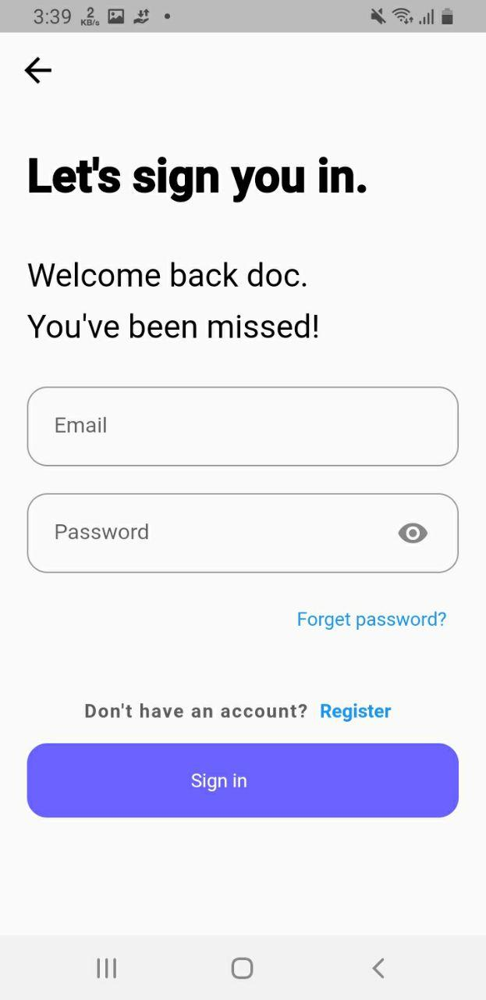

#Hakim
Hakim is a social media platform for doctors. We built this project for our Senior year project. It provides all the features needed from a social media. It is designed by consulting doctors and other medical professionals. 

### Some of the features are
* [X] Posting Clinical Cases
  * [X] Cases with image.
  * [X] Text only cases.
* [X] Facial Detection to enforce **No Face Policy** 
* [X] Comment on cases.
* [X] Follow Users.
* [X] Subscribe to a case to get updates from that case.
* [X] Chat with other doctors.
* [X] Search doctors.
* [X] Signup and login.
* [X] Account recovery.
* [X] Account Verfication.
* [X] Edit Profile.
* [X] Report cases that violate platform rules.
* [X] Request for verification.
  

### TODO
* [ ] Add Multilingual support
* [ ] Add dark theme

## Built with
* [X] Flutter
* [X] Firebase

## Download app

[Google Drive](https://drive.google.com/file/d/150CL9A7n2cvGgwMQtqADrVWfzl6vw34-/view?usp=drivesdk)

## Screnshoot
 

## License
[MIT](https://choosealicense.com/licenses/mit/)